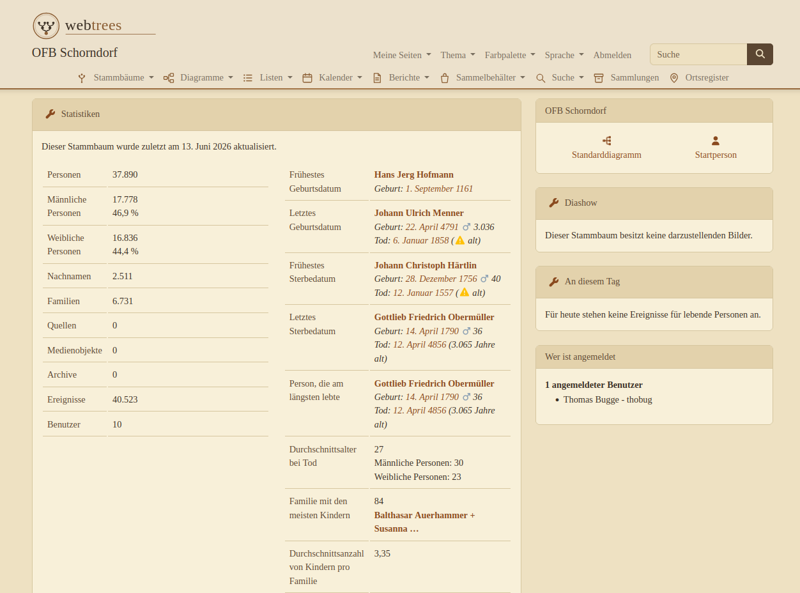
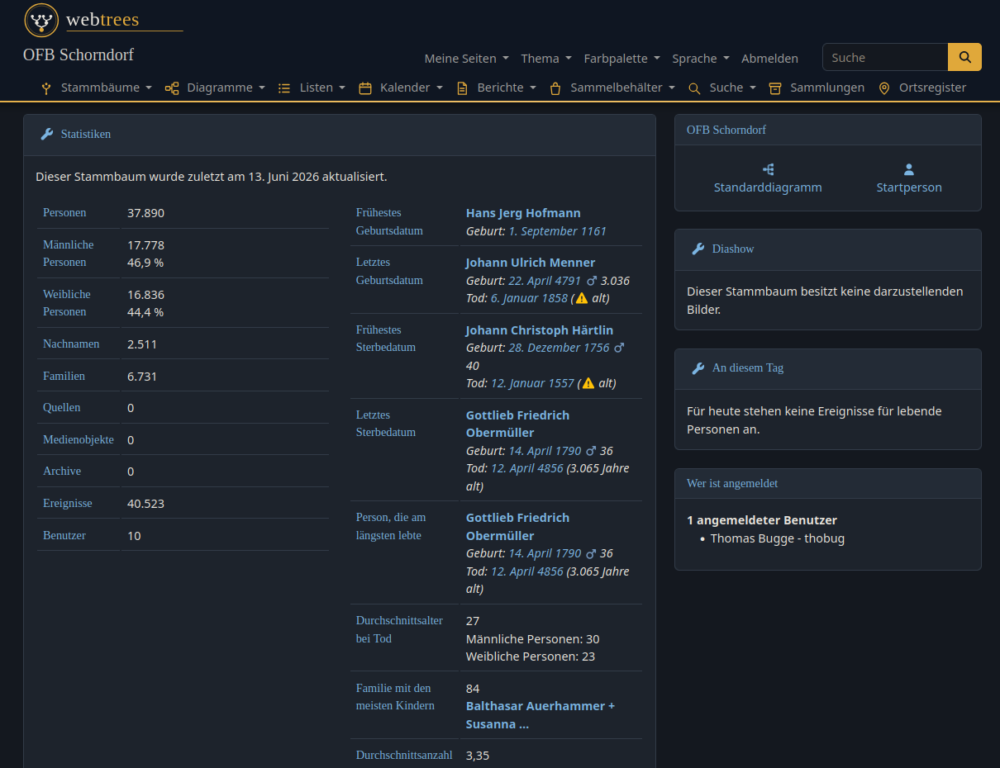

# Farbwelten

Ein Theme für [webtrees](https://webtrees.net) 2.2 mit vier Farbpaletten in einem einzigen Modul. Die Palette lässt sich im Kopfmenü umschalten, wie beim Core-Theme „colors".

*English version: [README.md](README.md)*

| Palette | Beschreibung |
|---|---|
| **Hell** | Navy und Gold auf warmem Papierton. Die Standardpalette. |
| **Dunkel** | Dark Mode mit Amber-Akzenten. |
| **Sepia** | Buchdruck-Optik für Ortsfamilienbücher, mit eigenem Druck-Stylesheet. |
| **Bordeaux** | Weinrot und Gold auf Creme. |

Alle Paletten teilen sich ein Struktur-Stylesheet und unterscheiden sich nur in den Farbvariablen. Die Textkontraste erfüllen in jeder Palette WCAG AA (mindestens 4,5:1).

## Screenshots

Sepia:

Dunkel:

## Funktionen

- Paletten-Menü im Kopfbereich. Jeder Benutzer behält seine eigene Wahl. Wählt ein Administrator eine Palette, wird sie Standard für Besucher.
- Serifen-Überschriften (Georgia), gestaltete Tabellen, Faktenblätter, Formulare, Tabs, Dropdowns und Diagramm-Boxen.
- Menü-Icons als SVG-Masken, die die Farben der aktiven Palette übernehmen.
- Druck-Stylesheet in der Sepia-Palette: Navigation wird ausgeblendet, Farben wechseln auf Schwarz-Weiß.
- Responsive, basiert auf dem Minimal-Theme von webtrees (Bootstrap 5).
- Versionsprüfung: Das Kontrollpanel meldet, wenn ein neues Release verfügbar ist.

## Voraussetzungen

- webtrees 2.2.x
- PHP 8.2 oder neuer

## Installation

1. Das [aktuelle Release](https://github.com/thobgg/webtrees-theme-farbwelten/releases) herunterladen.
2. Nach `modules_v4/theme-farbwelten/` der webtrees-Installation entpacken.
3. Unter *Kontrollpanel → Module → Alle Module → Farbwelten* prüfen, dass das Modul aktiv ist.
4. **Farbwelten** im Theme-Menü auswählen oder unter *Kontrollpanel → Website-Einstellungen → Standard-Theme* als Standard setzen.
5. Im neuen Menüpunkt **Palette** im Kopfbereich eine Palette wählen.

## Eigene Palette ergänzen

Das Layout steht in `resources/css/base.css` und verwendet ausschließlich CSS-Variablen (`--fa-*`). Eine Palette ist eine einzelne CSS-Datei, die diese Variablen belegt.

1. `resources/css/palette-hell.css` nach `resources/css/palette-<name>.css` kopieren und die Werte anpassen. Die Pflicht-Variablen sind in [PALETTEN-KONTRAKT.md](PALETTEN-KONTRAKT.md) dokumentiert.
2. Die Palette in der Methode `palettes()` in `module.php` eintragen.

## Hinweise

Der Icon-Satz deckt auch die Menü-Klassen der Module [Sammlungen](https://github.com/thobgg/webtrees-sammlungen) und [Ortsregister](https://github.com/thobgg/webtrees-ortsregister) ab. Ohne diese Module greifen die Selektoren nie, es gibt also keine Nebenwirkungen.

## Lizenz

GPL-3.0, siehe [LICENSE](LICENSE). Basiert auf Theme-Code von webtrees, © webtrees development team.
